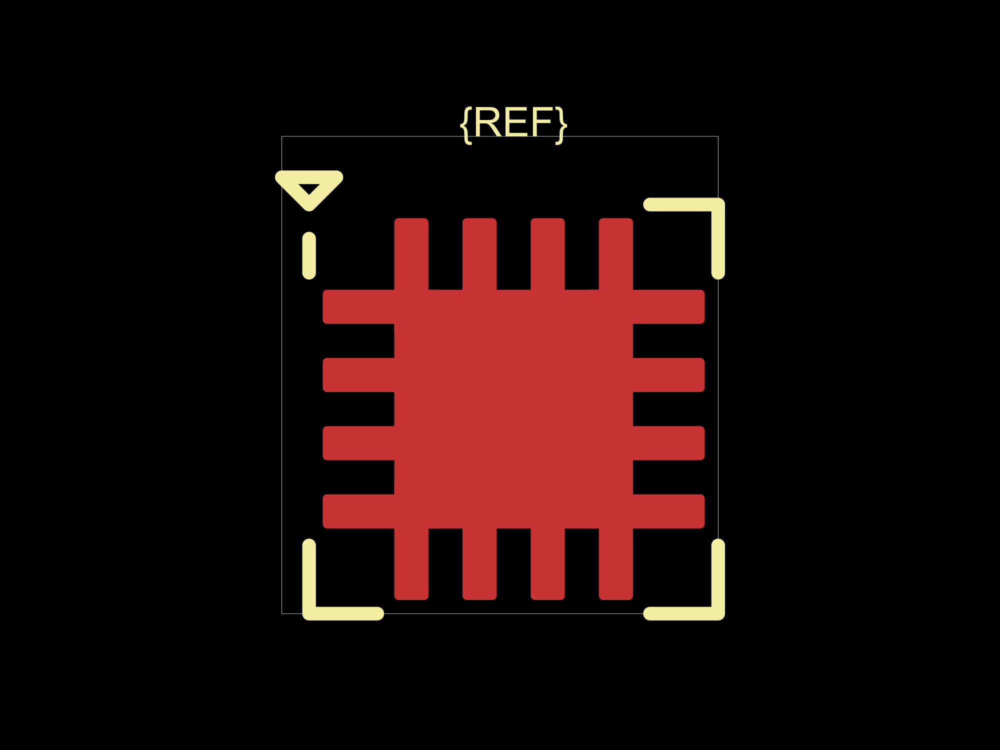

# Reproduction: default QFN thermal pad overlaps perimeter copper

Reproduced against `d9a981fffab5741178d49b7a070c3b8bd2110398` with Bun 1.3.14.
This is a reproduction, not a footprint correction or manufacturing approval.

## Run

```sh
bun install
bun test tests/qfn-default-thermalpad-overlap.test.ts
```

The file includes three passing visual snapshot tests and three `test.failing`
checks for the desired no-overlap invariant. Bun reports expected failures as
passing: this does **not** mean the copper geometry is safe. Remove `.failing`
to see the assertions fail normally, or when implementing a fix.

The smallest input is:

```ts
import { fp } from "@tscircuit/footprinter"

fp.string("qfn16_w3_h3_p0.5mm_thermalpad").circuitJson()
```

No circuit connections, placement, autorouting, or Gerber conversion are needed.

## Observed copper overlap

| Footprint string | Generated EP (mm) | Perimeter pins overlapping EP |
| --- | --- | --- |
| `qfn16_w3_h3_p0.5mm_thermalpad` | 1.75 × 1.75 | 1–16 |
| `qfn20_w4.5_h3.5_p0.5mm_thermalpad` | 2.25 × 2.25 | 6–10, 16–20 |
| `qfn8_w2_h2_p0.5mm_thermalpad` | 0.75 × 0.75 | 1–8 |

The pad bounding boxes penetrate the EP by 0.35 mm in the pad-length direction.
The tests use smaller, inscribed rectangles with the rounded corners removed;
their positive intersections prove this is not merely bounding-box contact.

For QFN16, pin 1 has center (-0.9625, 0.75), width 0.875 and height 0.25 mm.
Its inner x edge is -0.525 mm; the thermal pad starts at x = -0.875 mm and
ends at x = 0.875 mm, giving the observed 0.35 mm overlap.



Native SVG snapshots for all three cases are in `tests/__snapshots__`.

## Source of the geometry

`src/fn/qfn.ts` supplies `legsoutside: false` and a default pad length of
0.875 mm. `src/fn/quad.ts` positions those pads inside the package boundary,
including a 0.1 mm inward offset. Its boolean `thermalpad` branch sizes the EP
from the span of the pins along each side, without checking the available space
between the inward-facing ends of the pads. The combination can create copper
overlap for these accepted inputs. The test deliberately does not choose a
replacement EP size: valid land patterns require package-specific dimensions.

## Scope

These inputs came from a solar power-bank design whose Gerber short checker
reported 50 shorts. This reproduction establishes an upstream footprint
geometry problem, not the cause of every reported board short. Unmapped exposed
pads, manufacturer land-pattern mismatches, and the separate U4/U5 routing
conflict require independent board-level corrections. These generic strings
are not claimed to be verified BQ24074, TPS61088, or MAX17048 land patterns.
